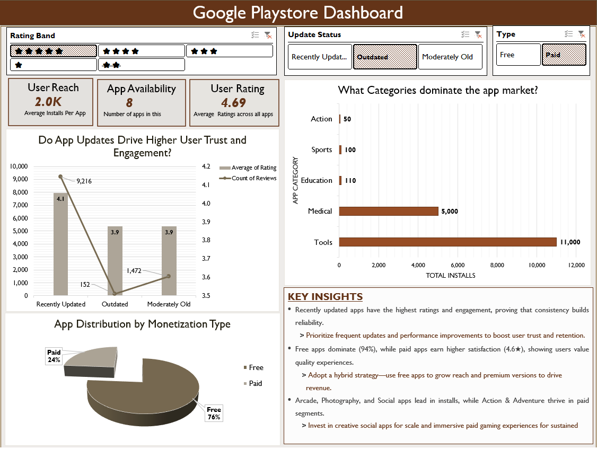
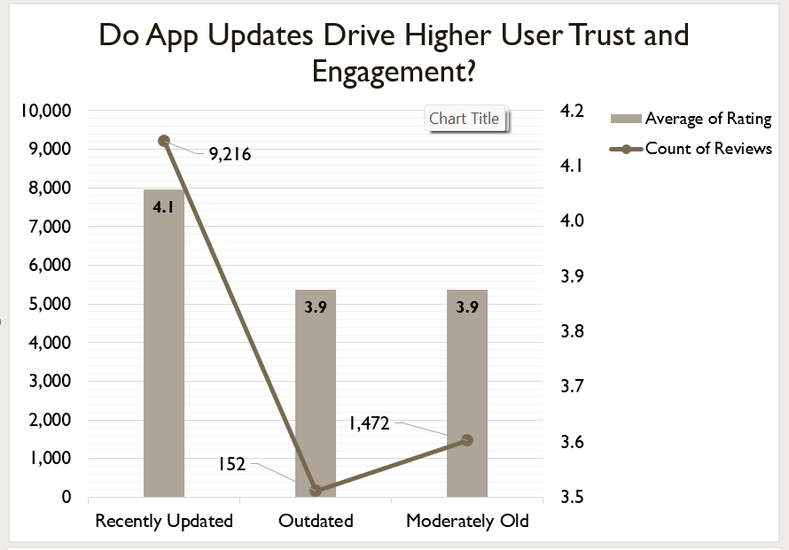
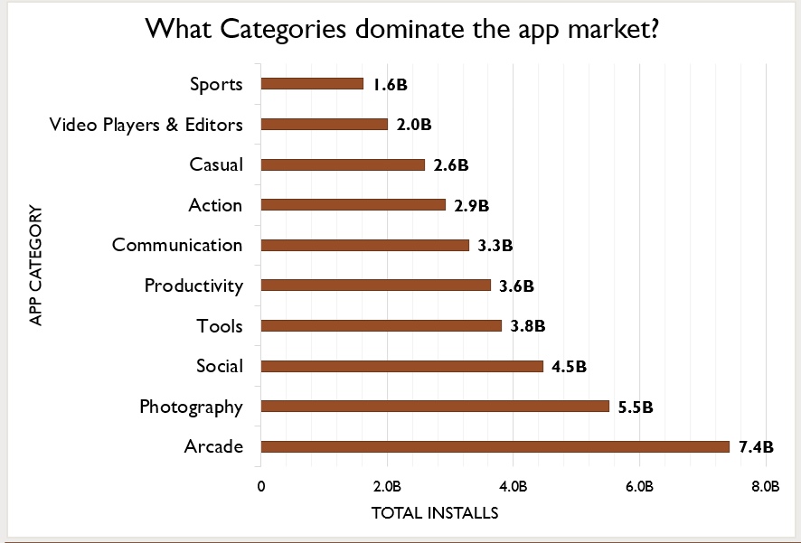
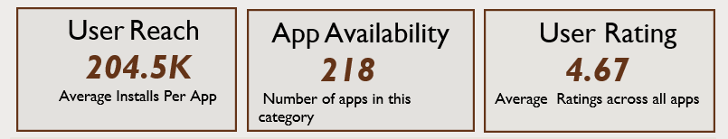
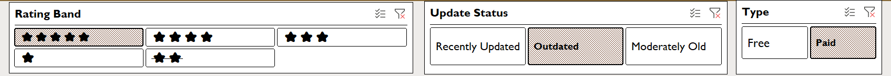

# 📊 Google Play Store Excel Dashboard  

### 🧠 Project Summary  
This project showcases an **interactive Excel dashboard** analyzing Google Play Store apps to uncover key insights on **category trends, update frequency, user engagement, ratings, and monetization patterns**.  

The goal was to visualize which app categories dominate the market, how update frequency affects engagement, and how free vs paid apps perform across different metrics.  

The dashboard helps **product and marketing teams** make data-driven decisions about app performance, strategy, and user behavior.  

---

### 🎯 Objectives  
- Understand category-wise distribution and popularity of apps  
- Compare performance between **Free vs Paid** apps  
- Identify relationships between **update status and user engagement**  
- Track installs, reviews, and average ratings using KPI cards and visuals  

---

### 🛠️ Tools & Techniques  
**Tool:** Microsoft Excel  
**Features Used:** Pivot Tables, Slicers, KPI Cards, Conditional Formatting, Charts (Bar, Pie, Column)  
**Data Source:** [Google Play Store Dataset (Kaggle)](https://www.kaggle.com/lava18/google-play-store-apps)  
**Skills Demonstrated:** Data Cleaning, EDA, Visualization, Dashboard Design  

---

### 📈 Dashboard Preview  

Here are some visuals from the final dashboard 👇  

#### Main Dashboard View  

#### Insight 1 — Update Frequency vs User Engagement  

#### Insight 2 — Top Performing Categories  

#### KPI Cards and Filters  
  
  

---

### 💡 Key Insights  
- **Recently updated apps** show higher user engagement (more installs and reviews).  
- **Free apps** dominate the market with ~93% share but generate lower revenue compared to paid apps.  
- **Top categories** like Productivity, Tools, and Entertainment drive maximum installs.  
- Regular updates and strong ratings correlate with better app performance.  

---

### 🧩 Conclusion  
This Excel dashboard demonstrates strong analytical and visualization skills — from **data cleaning and transformation** to **dashboard design** and **insight generation**.  

It highlights the ability to create clean, functional dashboards for **data-driven decision making**, ideal for roles in **data analytics and business intelligence**.  

---
